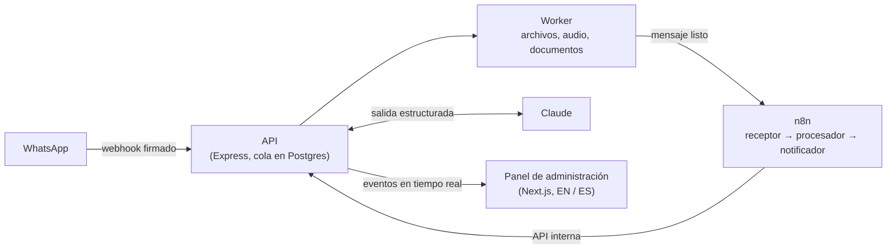

[English](README.md) · Español

# SmartOps Agent

**Un agente de operaciones con IA para negocios que trabajan por WhatsApp.** Proveedores, clientes
y personal mandan listas de precios, pedidos y consultas en cualquier formato: texto, fotos de
listas impresas, PDF, planillas, audios. SmartOps los lee, mantiene el catálogo de productos al
día, le pregunta a una persona cuando algo es dudoso y le avisa al equipo solo lo que requiere
acción. Una persona puede tomar cualquier chat en cualquier momento.

> Estado: hecho con estándar de producción y probado de punta a punta. **La demo pública está en
> línea:** [https://smartops-demo.duckdns.org](https://smartops-demo.duckdns.org) (datos de
> ejemplo, gratis, se reinicia cada hora). La pantalla de ingreso muestra la cuenta de demo
> compartida; "Probar el sistema" envía mensajes de ejemplo por el procesamiento real. El panel
> está en inglés y en español: elige el idioma en el selector de arriba a la derecha.

> **Demo pública y sistema real.** La demo pública corre en una VM gratuita de 1 GB, así que usa un
> orquestador liviano dentro del mismo proceso en lugar de n8n (y la API y el worker en un solo
> proceso). El sistema real usa n8n; un test de paridad comprueba que los dos hacen las mismas
> llamadas ([ADR-025](docs/adr/ADR-025-light-demo-profile.md), en inglés).

## Míralo


La animación tiene textos en inglés. Las capturas de abajo son del panel en español:

| Inicio                                                                                                                                                      | Elegir la columna de precios de una planilla                                                                                                                                            |
| ----------------------------------------------------------------------------------------------------------------------------------------------------------- | --------------------------------------------------------------------------------------------------------------------------------------------------------------------------------------- |
|  |  |
| **Historial de precios**                                                                                                                                    | **Una conversación**                                                                                                                                                                    |
|               |                                                     |

## Qué hace

- **Lee cualquier formato.** Recibe texto, fotos, PDF y archivos de Word, lee las planillas por
  código cuando ya conoce su formato y transcribe los audios. Claude extrae los precios con una
  salida estructurada y validada.
- **Mantiene el catálogo correcto.** Reconoce productos aunque el nombre cambie, aplica los
  cambios de precio, guarda el historial y distingue una lista completa de una actualización
  parcial. Vigila precios atípicos, cambios de moneda e IVA, y productos que desaparecen de una
  lista completa.
- **Nunca adivina.** Todo lo dudoso de un mensaje pasa a revisión para una persona, con el mensaje
  original al lado: una coincidencia incierta, un mensaje sospechoso, un formato de planilla nuevo,
  un audio que no se entendió.
- **Trabaja con las personas.** La respuesta de una persona pausa solo las respuestas automáticas
  del bot en ese chat, y el bot vuelve solo más tarde. Las palabras de baja se respetan. El equipo
  recibe un resumen por WhatsApp por período en lugar de un mensaje por cada novedad.
- **Cuesta poco.** Un filtro previo determinístico deja fuera de la IA los saludos, los stickers y
  la charla de clientes. Las planillas con un formato conocido cuestan $0. Los topes de gasto se
  controlan antes de cada llamada a la IA. Gasto total de IA durante todo el desarrollo:
  **~$0,32**.

## Cómo funciona



El backend es dueño de cada regla y de cada escritura; n8n orquesta los tres agentes como flujos
de trabajo visuales. Cada paso es idempotente, así que los reintentos nunca duplican nada.
Detalles: [docs/architecture.md](docs/architecture.md) (en inglés).

## Aspectos de ingeniería

| Área            | Qué hay                                                                                                                                                                                                 |
| --------------- | ------------------------------------------------------------------------------------------------------------------------------------------------------------------------------------------------------- |
| Confiabilidad   | El webhook se guarda antes de responder 200, un outbox transaccional hacia n8n, colas con reintentos y mensajes muertos, e idempotencia en cada paso                                                    |
| Seguridad de IA | Los documentos son datos, nunca instrucciones; las salidas se validan con Zod; las inyecciones detectadas pasan a revisión. Evaluación con el modelo real: 8/8 casos aprobados (6 ataques, 2 controles) |
| Seguridad       | Webhooks firmados, sesiones con refresh rotativo y detección de reutilización, Argon2id, controles CSRF, roles, logs enmascarados, escaneo de secretos ([más](docs/security.md), en inglés)             |
| Tests           | API: 1.397 tests unitarios y HTTP + 229 contra un Postgres real. Panel: 193 tests unitarios + 128 tests de navegador (Chrome de escritorio, Pixel 7, iPhone / WebKit) con axe. Mutation score de 80 %   |
| CI/CD           | GitHub Actions: lint, tipos, tests, umbral de cobertura, E2E, escaneo de imágenes; release-please; imágenes amd64 + arm64                                                                               |
| Idiomas         | Panel en inglés y español, a elección de cada usuario; textos de WhatsApp en el idioma del negocio                                                                                                      |
| Accesibilidad   | Mobile first, WCAG 2.1 AA verificado con axe en los dos idiomas                                                                                                                                         |

## Stack tecnológico

| Capa           | Tecnología                                                                                         |
| -------------- | -------------------------------------------------------------------------------------------------- |
| Backend        | Node.js 24, Express 5, TypeScript, Zod, Prisma 7, PostgreSQL 17, pg-boss                           |
| IA             | Claude (Anthropic SDK), Whisper en Groq, detrás de interfaces de proveedor intercambiables         |
| Orquestación   | n8n (autoalojado)                                                                                  |
| Frontend       | Next.js 15, React 19, Tailwind CSS 4, shadcn/ui, TanStack Query, next-intl                         |
| Mensajería     | WhatsApp Business Cloud API                                                                        |
| Herramientas   | pnpm workspaces, Vitest, Playwright, ESLint, Prettier, GitHub Actions, Docker                      |
| Hosting (demo) | Oracle Cloud Always Free micro VM, Caddy, Docker Compose — $0 ([costos](docs/costs.md), en inglés) |

## Ejecútalo en local

Requisitos: Node.js 24, pnpm 12 y Docker. No hace falta una cuenta de Meta: un simulador local
reemplaza a WhatsApp.

```bash
pnpm install
cp .env.example .env && cp apps/api/.env.example apps/api/.env && cp apps/admin/.env.example apps/admin/.env.local
docker compose up -d
pnpm --filter @smartops/api db:migrate
pnpm dev   # API en :4000 + worker, panel en :3000
```

La guía completa (variables de entorno, el simulador de WhatsApp, el modo demo, los tests):
[docs/development.md](docs/development.md) (en inglés).

## Documentación

Todos los documentos están listados en [docs/README.md](docs/README.md) (en inglés). Los
principales:

- [Guía del panel](docs/guide/guia-del-panel.md) — cada pantalla, para el dueño del negocio y el
  equipo (versión en inglés: [Panel guide](docs/guide/panel-guide.md))
- [Caso de estudio](docs/caso-de-estudio.md) — el problema, el enfoque, los resultados medidos y
  lo aprendido (versión en inglés: [Case study](docs/case-study.md))
- [Arquitectura](docs/architecture.md) (en inglés) — componentes, el recorrido de un mensaje, el
  modelo de datos
- [Seguridad](docs/security.md) (en inglés) — controles, sesiones, el servidor de la demo, límites
  conocidos
- [Costos](docs/costs.md) (en inglés) — la demo a $0 y una estimación para un cliente real
- [Desarrollo](docs/development.md) (en inglés) — instalación, scripts, variables de entorno
- [Tests](docs/testing.md) y [CI/CD](docs/ci-cd.md) (en inglés)
- [Registros de decisiones de arquitectura](docs/adr/) (en inglés)

## Licencia

Copyright (c) 2026 Ignacio Sánchez ([sanchezign](https://github.com/sanchezign)). Todos los
derechos reservados: este repositorio se comparte solo para revisión de portfolio. Ver
[LICENSE](LICENSE).
