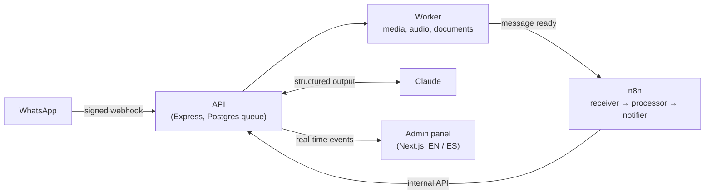

# SmartOps Agent

**An AI operations agent for businesses that run on WhatsApp.** Suppliers, customers and staff
send price lists, orders and questions in every format: text, photos of printed lists, PDFs,
spreadsheets, voice notes. SmartOps reads them, keeps the product catalog up to date, asks a
person when something is doubtful, and tells the team only what needs action. People can take
over any chat at any moment.

> Status: built to production standards and tested end to end. The public demo server is being
> deployed (phase 12). This README will link to it once it is live.

## What it does

- **Reads every format.** It takes text, photos, PDFs and Word files, reads spreadsheets by code
  once their format is known, and transcribes voice notes. Claude extracts the prices with
  structured, validated output.
- **Keeps the catalog right.** It matches products even when names differ, applies price changes,
  records the history, and tells full lists apart from partial updates. It watches for outliers,
  currency and VAT changes, and products that disappear from a full list.
- **Never guesses.** Anything doubtful becomes a review item for a person, with the original
  message next to it: an uncertain match, a suspicious message, a new spreadsheet format, a
  voice note that was not understood.
- **Works with people.** A person's reply pauses only the bot's automatic answers in that chat,
  and the bot comes back later by itself. Opt-out keywords are respected. The team receives one
  WhatsApp summary per window instead of a message per event.
- **Costs little to run.** A deterministic pre-filter keeps greetings, stickers and customer
  chat away from the AI. Known spreadsheet formats cost $0. Spend caps are checked before every
  AI call. Total AI spend while building the whole project: **$0.24**.

## How it works



The backend owns every rule and every write; n8n orchestrates the three agents as visual
workflows. Every step is idempotent, so retries never duplicate anything. Details:
[docs/architecture.md](docs/architecture.md).

## Engineering highlights

| Area          | What is in place                                                                                                                                                                |
| ------------- | ------------------------------------------------------------------------------------------------------------------------------------------------------------------------------- |
| Reliability   | Webhook stored before the 200 answer, a transactional outbox to n8n, queues with backoff and dead letters, idempotency at every step                                            |
| AI safety     | Documents are data, never instructions; outputs validated with Zod; injection attempts stop for review. Real-model evaluation: 8/8 cases passed (6 attacks, 2 controls)         |
| Security      | Signed webhooks, rotating refresh sessions with reuse detection, Argon2id, CSRF checks, roles, masked logs, secret scanning ([more](docs/security.md))                          |
| Tests         | API: 1,087 unit and HTTP tests + 222 against a real Postgres. Panel: 119 unit tests + 85 browser tests (desktop Chrome, Pixel 7, iPhone / WebKit) with axe. Mutation score 80 % |
| CI/CD         | GitHub Actions: lint, types, tests, coverage gate, E2E, image scans; release-please; amd64 + arm64 images                                                                       |
| Languages     | Panel in English and Spanish, chosen per user; WhatsApp texts in the business's language                                                                                        |
| Accessibility | Mobile first, WCAG 2.1 AA checked with axe in both languages                                                                                                                    |

## Tech stack

| Layer          | Technology                                                                       |
| -------------- | -------------------------------------------------------------------------------- |
| Backend        | Node.js 24, Express 5, TypeScript, Zod, Prisma 7, PostgreSQL 17, pg-boss         |
| AI             | Claude (Anthropic SDK), Whisper on Groq, behind swappable provider interfaces    |
| Orchestration  | n8n (self-hosted)                                                                |
| Frontend       | Next.js 15, React 19, Tailwind CSS 4, shadcn/ui, TanStack Query, next-intl       |
| Messaging      | WhatsApp Business Cloud API                                                      |
| Tooling        | pnpm workspaces, Vitest, Playwright, ESLint, Prettier, GitHub Actions, Docker    |
| Hosting (demo) | Oracle Cloud Always Free VM, Caddy, Docker Compose — $0 ([costs](docs/costs.md)) |

## Run it locally

Requirements: Node.js 24, pnpm 12 and Docker. No Meta account is needed: a local simulator
stands in for WhatsApp.

```bash
pnpm install
cp .env.example .env && cp apps/api/.env.example apps/api/.env && cp apps/admin/.env.example apps/admin/.env.local
docker compose up -d
pnpm --filter @smartops/api db:migrate
pnpm dev   # API on :4000 + worker, panel on :3000
```

The full guide (environment variables, the WhatsApp simulator, the demo mode, tests):
[docs/development.md](docs/development.md).

## Documentation

All documents are listed in [docs/README.md](docs/README.md). The main ones:

- [Architecture](docs/architecture.md) — components, the path of a message, the data model
- [Security](docs/security.md) — controls, sessions, the demo server, known limits
- [Costs](docs/costs.md) — the $0 demo and an estimate for a real client
- [Development](docs/development.md) — setup, scripts, environment variables
- [Testing](docs/testing.md) and [CI/CD](docs/ci-cd.md)
- [Architecture decision records](docs/adr/)

## License

Copyright (c) 2026 [sanchezign](https://github.com/sanchezign). All rights reserved: this
repository is shared for portfolio review only. See [LICENSE](LICENSE).
