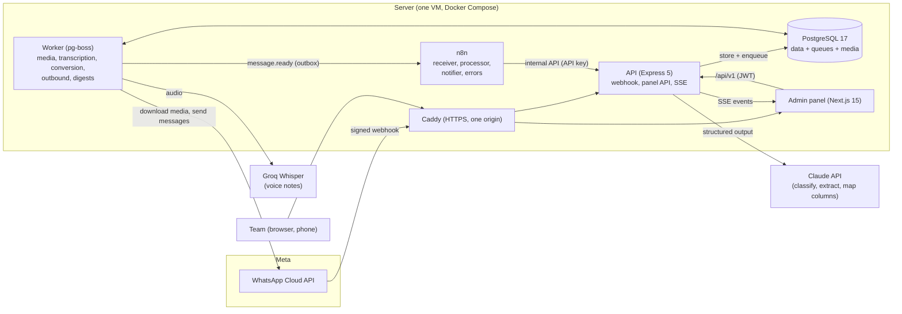
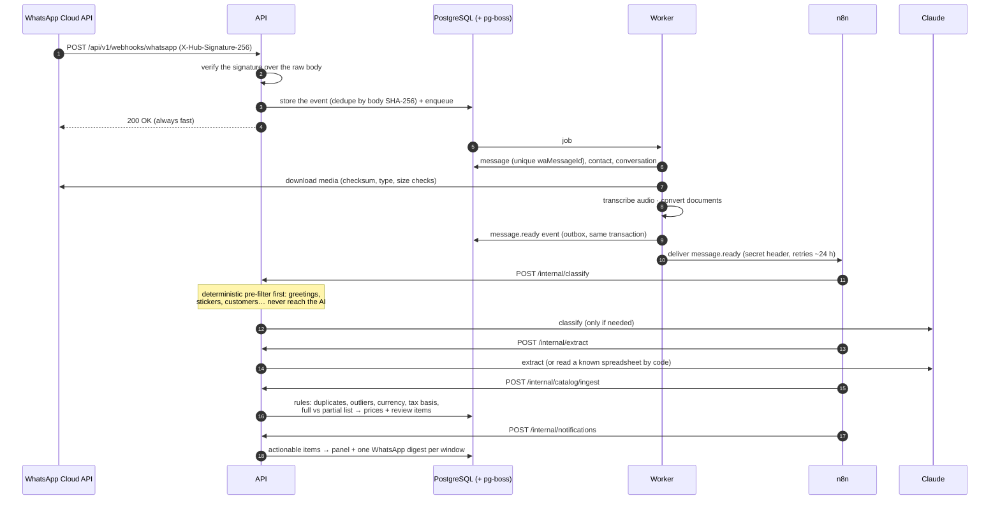
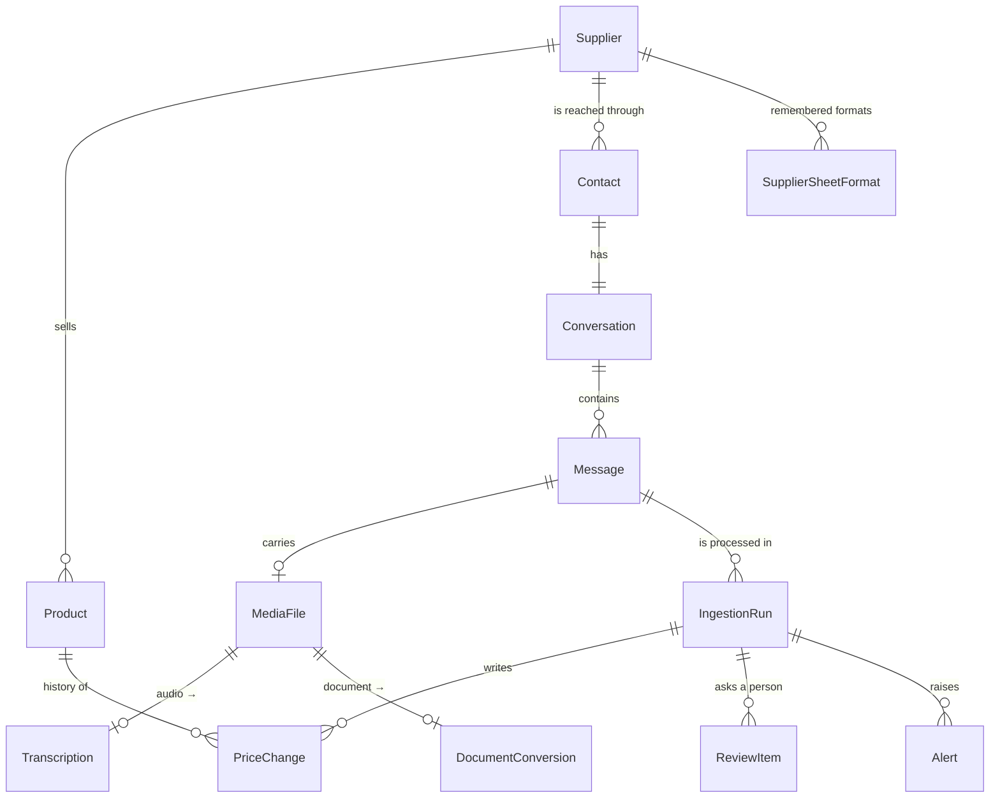

# Architecture

SmartOps Agent turns the messages that suppliers, customers and staff send over WhatsApp
(text, photos, PDFs, spreadsheets, voice notes) into an up-to-date product catalog, alerts and
a review queue. The decisions behind each part are recorded as ADRs in [docs/adr](adr/).

## Components



- **API** (`apps/api`, Express 5 + TypeScript + Prisma): the WhatsApp webhook, the internal API
  that n8n calls, the panel API, and real-time events (SSE). It owns every rule, all validation
  and every write.
- **Worker** (same code base, `node dist/worker.js`): pg-boss jobs for webhook processing, media
  download, transcription, document conversion, outbound messages, n8n delivery and digests.
- **PostgreSQL**: application data, the pg-boss queues (schema `pgboss`) and media bytes (ADR-008).
- **n8n** (self-hosted): orchestrates the three agents (receiver → processor → notifier) as
  visual workflows. It never touches the database; it only calls the backend (ADR-002, ADR-015).
- **Admin panel** (`apps/admin`, Next.js 15): reviews, conversations, catalog, alerts, rules and
  users. It runs in English or Spanish (ADR-024).
- **Claude** classifies messages, extracts price lists and maps new spreadsheet formats, always
  through structured outputs that are validated again with Zod (ADR-011).
- **Groq** transcribes voice notes (Whisper), behind a `Transcriber` interface (ADR-010).

## The path of a message



Every step is idempotent: a repeated webhook, a retried job or a repeated n8n call never
creates a second message, run, price change or notification.

## Design choices

| Concern            | Choice                                                                                                                            | ADR      |
| ------------------ | --------------------------------------------------------------------------------------------------------------------------------- | -------- |
| Webhooks           | Signature over the raw body, store before 200, queue, idempotency by event hash and by `waMessageId`                              | 003      |
| Hand-off to n8n    | Transactional outbox (`integration_events`), retries for ~24 h, a watchdog, manual replay                                         | 015      |
| AI cost            | Deterministic pre-filter, known spreadsheet formats read without AI, spend caps checked before each call, a ledger per call       | 011, 014 |
| AI safety          | Documents are data (tagged, neutralized); outputs validated with Zod; injection attempts stop the run for a person                | 011      |
| Doubtful decisions | Never guessed: review items (uncertain matches, outliers, currency or tax changes, new formats, suspicious messages)              | 012      |
| People and the bot | A human reply pauses only automatic replies to that contact; processing and team alerts go on                                     | 016      |
| Consent            | Opt-in for business-initiated messages; deterministic opt-out keywords; gated at the outbound service                             | 009, 017 |
| Panel security     | Short-lived JWT in memory, rotating refresh cookie with reuse detection, Argon2id, CSRF checks, roles, one origin                 | 018      |
| Real time          | Postgres triggers → one LISTEN per API process → SSE to every open panel                                                          | 020      |
| Public demo        | `DEMO_MODE`: the real pipeline with fake AI, transcriber and Graph API; it refuses real keys and any non-demo database            | 021      |
| Languages          | Panel in English and Spanish (per user); WhatsApp texts in the business language                                                  | 024      |
| CI/CD              | GitHub Actions: quick checks on every push; coverage, E2E and image checks on PRs; amd64 + arm64 images scanned before publishing | 022      |

## Data model (core)



Money is `Decimal(18,4)` (never a float) and is sent as a JSON string. Ids are UUIDv7. Some
integrity rules live in hand-written SQL (CHECK constraints, partial unique indexes, triggers)
and are listed in `apps/api/test/integration/migrations.test.ts`.

## Code layout

```
apps/api/src/
  app.ts, server.ts, worker.ts   composition (no listen in app.ts), HTTP bootstrap, worker bootstrap
  config/env.ts                  the only entry point for environment variables (Zod)
  common/                        errors, logger, middleware, business texts, JSON helpers
  ai/                            LLM provider interface, Anthropic + fake providers, prompts/*.md
  modules/<feature>/             routes → controller → service → repository (only repositories touch Prisma)
apps/admin/src/
  app/                           routes ((auth) login, (main) panel), error and not-found pages
  features/<feature>/            components, hooks, pure logic (unit-tested), types
  i18n/                          language resolution, request config, en/es messages
  lib/                           API client, formatting, number inputs
n8n/workflows/                   exported workflows (no credentials)
deploy/                          the server bundle (Compose, Caddyfile, scripts)
```
